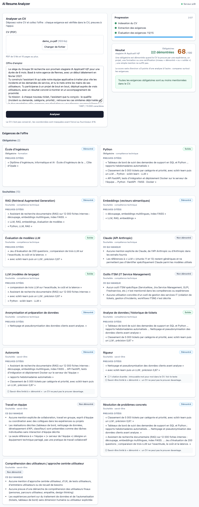
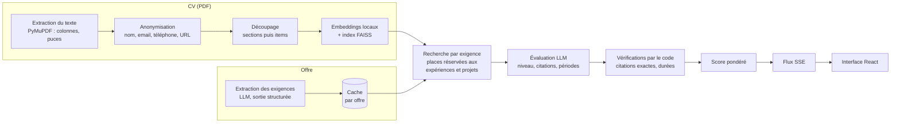
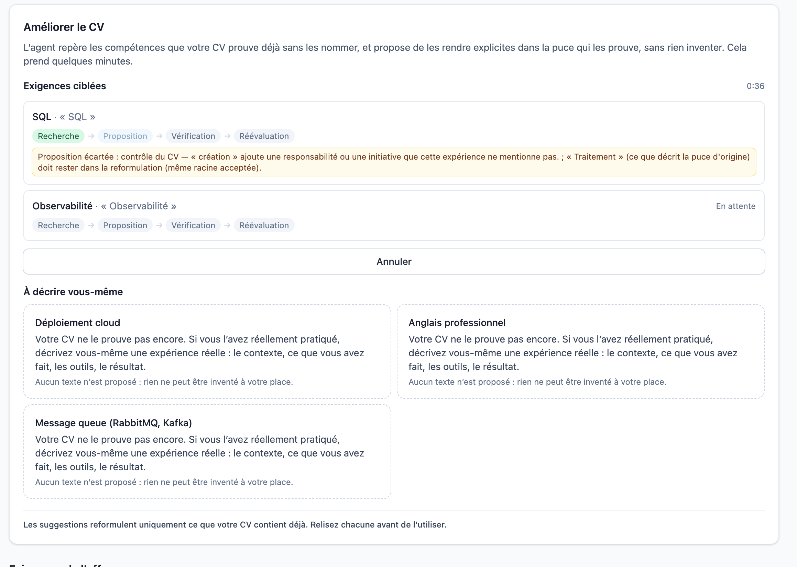

# AI Resume Analyzer

[](https://github.com/jaddaoud001-code/ai-resume-analyzer/actions/workflows/ci.yml)

Compare un CV (PDF) à une offre d'emploi, exigence par exigence. Chaque exigence de l'offre (compétences, formation, langues, savoir-être) reçoit un niveau (non démontré, mentionné, démontré, solide) justifié par des **citations exactes du CV, vérifiées par le code**, avec ce qui manque. Le résultat arrive en temps réel, exigence après exigence, et se conclut par un score et la liste des exigences obligatoires non démontrées.

<!-- Capture d'écran : analyse du CV de démonstration (backend/eval/cvs/demo_cv.pdf) sur l'offre
     backend/eval/offers/sii.txt, à enregistrer dans docs/screenshot.png -->


**Stack** : Python 3.13, FastAPI, LangChain, FAISS, PyMuPDF, fastembed (ONNX) · React 19, TypeScript strict, Vite, Tailwind · Server-Sent Events · Docker, Nginx · pytest, Vitest, ruff, oxlint, GitHub Actions.

## Pipeline


```mermaid
flowchart LR
    subgraph CV["CV (PDF)"]
        A[Extraction du texte<br/>PyMuPDF : colonnes, puces] --> B[Anonymisation<br/>nom, email, téléphone, URL]
        B --> C[Découpage<br/>sections puis items]
        C --> D[Embeddings locaux<br/>+ index FAISS]
    end
    subgraph Offre
        E[Extraction des exigences<br/>LLM, sortie structurée] --> F[(Cache<br/>par offre)]
    end
    D --> G[Recherche par exigence<br/>places réservées aux<br/>expériences et projets]
    F --> G
    G --> H[Évaluation LLM<br/>niveau, citations, périodes]
    H --> I[Vérifications par le code<br/>citations exactes, durées]
    I --> J[Score pondéré]
    J --> K[Flux SSE] --> L[Interface React]
```

1. Le texte du PDF est extrait dans l'ordre de lecture (colonnes détectées, puces rattachées), puis **anonymisé** : seuls des extraits sans nom ni coordonnées quittent la machine.
2. Le CV est découpé selon sa structure (sections, puis un chunk par expérience, projet ou formation) et indexé en local (FAISS, similarité cosinus).
3. Le LLM extrait de l'offre une liste d'exigences atomiques, avec leur importance (obligatoire / souhaitée) et des reformulations pour la recherche ; le résultat est mis en cache par offre.
4. Pour chaque exigence, la recherche retrouve les passages du CV les plus proches, et le LLM rend un niveau, des citations et, si l'offre exige une durée, des périodes.
5. Le code vérifie tout ce qui est vérifiable : citations présentes mot pour mot dans le passage cité, dates présentes dans le CV, durées additionnées. Il rétrograde ce qui ne tient pas, puis calcule le score.
6. Chaque étape est envoyée au navigateur dès qu'elle est prête (Server-Sent Events).
7. Après l'analyse, l'utilisateur peut demander des **suggestions** : l'agent repère les compétences que le CV prouve déjà sans les nommer et propose de les nommer dans la puce qui les prouve, sans rien inventer. Chaque suggestion montre la puce d'origine, la puce proposée (mots ajoutés surlignés), les citations exactes du CV qui l'appuient et un niveau indicatif ; l'utilisateur l'accepte ou la refuse (rien n'est envoyé ni conservé), puis copie les puces acceptées. Les compétences que le CV ne prouve pas reçoivent une invitation à décrire soi-même une expérience réelle, sans texte proposé.

## Choix techniques et compromis

| Choix | Pourquoi | Compromis |
|---|---|---|
| **Embeddings locaux** (fastembed, `multilingual-e5-large`, ONNX) | Le CV n'est envoyé à aucun service d'embeddings ; pas de PyTorch (image plus légère, compatible macOS x86_64) | ~2,2 Go à télécharger une fois ; OpenAI ou Mistral restent configurables |
| **Deux modèles LLM** (`LLM_MODEL`, `MATCH_LLM_MODEL`) | Extraction (un appel) et évaluation (un appel par exigence) n'ont pas les mêmes besoins de qualité et de coût | Un réglage de plus ; avec l'offre gratuite de Groq, le même modèle (`openai/gpt-oss-120b`) sert aux deux, l'évaluation avec un effort de raisonnement réduit (`MATCH_LLM_REASONING_EFFORT=low`) |
| **Citations vérifiées par le code** | Le LLM doit citer le CV mot pour mot ; une citation introuvable est écartée, un niveau sans preuve valide est ramené à « non démontré » | Une reformulation du LLM ferait perdre une preuve : normalisation (casse, accents, typographie, « … » à la place d'un retour à la ligne) et **seconde chance** (si toutes les citations sont rejetées, un appel supplémentaire demande de les recopier mot pour mot ou de baisser le niveau, revérifié avec les mêmes règles) |
| **Durées calculées en Python** | Le LLM relève les périodes ; le code vérifie que leurs dates figurent dans le CV, fusionne les chevauchements et compare à la durée exigée | Seules les périodes explicitement datées comptent |
| **Recherche sensible aux sections** | Les listes de compétences, très proches des requêtes, occupaient tout le top k : des places sont réservées aux expériences et projets, et un passage qui contient le mot exact de l'exigence n'est jamais exclu | Heuristique fondée sur les titres de section |
| **Limiteur partagé** | Tous les appels au LLM passent par un même limiteur (débit, concurrence) ; sur 429, attente adaptée (`Retry-After`, reprise des tokens de la minute, fenêtre par minute) et toutes les analyses concernées en sont informées ; quota journalier épuisé, clé ou modèle refusés : arrêt immédiat avec un message clair, sans nouvelle tentative | Une analyse dure 5 à 6 minutes avec l'offre gratuite de Groq |
| **Cache des exigences** | Même offre, mêmes exigences : résultats comparables d'une analyse à l'autre, un appel LLM économisé | En mémoire, par processus ; clé = offre normalisée + modèle + version du prompt |
| **SSE** (plutôt que WebSocket ou polling) | Flux unidirectionnel serveur -> navigateur, simple à relayer (Nginx) ; le navigateur le lit avec `fetch` (POST du CV) et un parseur écrit à la main | Pas de reconnexion automatique (voulu : une coupure n'entraîne jamais une nouvelle analyse) |

Autres garde-fous : l'offre et le CV sont traités comme des **données non fiables** (isolés entre balises, instructions qu'ils contiennent ignorées) ; toute sortie du LLM passe par un modèle Pydantic ; un test de contrat garantit que le frontend comprend chaque événement émis par le backend.

## Agent de suggestions

Après l'analyse, un bouton lance un **agent qui rend explicites des compétences que le CV prouve déjà, sans rien inventer**. Exemple observé lors d'un essai : la puce « Traitement des requêtes lentes de la base des commandes : index et réécriture des requêtes » prouve SQL (l'expérience cite PostgreSQL), mais ne le nomme pas ; un recruteur pressé ou un tri par mots-clés passe à côté. L'agent propose « Traitement des requêtes lentes **SQL** de la base des commandes… », en montrant la citation exacte du CV qui l'appuie et l'implication utilisée (PostgreSQL → SQL). Les compétences que le CV ne prouve pas ne reçoivent **aucun texte** : une carte invite à décrire soi-même une expérience réelle.




Ci-dessus, en fin d'exécution : la reformulation proposée pour SQL a été écartée à la réévaluation (le vrai matcher la jugeait moins probante, « solide → démontré ») et n'est donc pas proposée ; pour l'observabilité, l'agent a ajouté « monitoring », un équivalent direct du terme de l'offre (voir les pistes d'amélioration), et la suggestion a été acceptée puis copiée.

**Pourquoi un agent ici, et pas pour le matching.** Le matching est un appel au LLM par exigence, encadré par des vérifications du code. Sur les cas de référence, il trouve le bon niveau pour **38 exigences techniques sur 38**, sans faux positif ; sur les cas difficiles, 19 sur 20. Les écarts restants viennent d'un jugement du modèle ou de sa variance, qu'une boucle d'agent ne corrigerait pas, alors qu'elle multiplierait les appels (une analyse coûte déjà ~40 000 tokens, pour 200 000 par jour dans l'offre gratuite de Groq). Les suggestions, elles, sont un vrai travail en plusieurs étapes avec retour d'erreur : choisir la puce, reformuler, se faire refuser avec un motif précis, réessayer. Pendant l'évaluation, deux suggestions fidèles sur sept ne sont apparues qu'à la seconde tentative, après un refus motivé du contrôle.

**Le graphe** (LangGraph, `backend/app/suggestions.py`) :
1. **Cibles, par le code** : les compétences techniques jugées « démontré » ou « solide » dont aucune preuve citée ne nomme le terme de l'offre (preuve par une implication, une ligne de technologies ou une pratique décrite sans son nom). Les compétences et langues non prouvées reçoivent une carte « décrivez-le », sans appel au LLM.
2. **Recherche** : le LLM choisit, parmi les puces de l'expérience qui porte la preuve, celle qui peut nommer le terme, ou dit qu'aucune ne le peut.
3. **Proposition** : une seule puce réécrite, avec la citation exacte de chaque fait.
4. **Vérification** : le contrôle du code, puis un juge LLM qui ne peut que rejeter. Un rejet renvoie à la proposition avec son motif (deux tentatives au plus).
5. **Réévaluation** : la puce est appliquée en mémoire et le vrai matcher réévalue l'exigence ; si le niveau baisse, la suggestion est écartée.

Budgets de tokens par exigence et par exécution, limiteur de débit partagé avec l'analyse, arrêt propre sur quota épuisé, annulation à la déconnexion.

**Les garde-fous sont dans le code** (`backend/app/grounding.py`, `backend/app/terms.py`) :
- **Ancrage** : chaque fait cite le CV mot pour mot, dans la même expérience ; aucun nombre, nom, outil ou technologie nouveau, sauf une compétence impliquée par la table des implications (FastAPI → Python, PostgreSQL → SQL) ou un nom de pratique que la puce décrit exactement (« CI/CD » pour des tests et un déploiement lancés à chaque fusion).
- **Termes contrôlés** : « cloud », « REST », « anonymisation »… ne s'écrivent que s'ils figurent déjà dans l'expérience (une pseudonymisation n'est pas une anonymisation).
- **Responsabilités ajoutées** : « mise en place », « conception », « création », « pilotage », « responsable »… sont refusés s'ils n'y figurent pas déjà.
- **Premier mot** : le mot qui ouvre la puce, et qui dit ce qui a été fait, doit rester (« Classement » ne devient pas « Analyse »).
- **Terme exigé** : la puce proposée doit nommer le terme de l'offre.

**Le juge LLM et sa limite.** Pendant toute l'évaluation, le juge n'a **jamais rejeté** une proposition, et il a laissé passer la seule invention. Toutes les tentations ont été arrêtées par le code. Le juge reste en place comme second filtre, mais c'est le code qu'on étend quand l'audit trouve une invention.

**La validation reste humaine.** Rien n'est appliqué au CV : chaque suggestion est acceptée ou refusée par l'utilisateur, puis copiée. L'interface n'affiche que les citations exactes du CV, jamais les explications rédigées par le modèle, et elle précise que les suggestions ne changent pas le score : l'analyse reconnaissait déjà ces compétences.

**Résultats de l'évaluation** (5 cas avec cibles, 11 exigences traitées, chaque suggestion auditée à la main ; `backend/eval/eval_suggestions.py`, annotations dans `backend/eval/suggestions/`) :

| Mesure | Résultat |
|---|---|
| Gains fidèles (terme de l'offre nommé, fait inchangé, niveau maintenu) | **7 sur 7** reformulations possibles |
| Refus justes (aucune reformulation honnête : « cloud », « REST », « anonymisation ») | **4** |
| Faux refus | **0** |
| Inventions | **1**, trouvée à l'audit humain (« **Mise en place d'**un pipeline CI/CD », une responsabilité que la puce ne disait pas), puis **bloquée par une règle du code** : relancé, le modèle l'a proposée de nouveau, le contrôle l'a écartée, et la seconde tentative était fidèle |
| Coût | ~56 000 tokens pour les 5 cas, soit **~5 100 tokens par exigence traitée** ; une exécution coûte 5 700 à 16 000 tokens et dure 1 à 3,5 minutes |

**Comment l'objectif a changé.** La première version cherchait à faire **monter le niveau** des exigences faibles (« mentionné » → « démontré ») en reformulant le CV. Le premier essai réel a montré que le matcher créditait déjà les faits mal formulés (implications, lignes de technologies, pratiques décrites), et qu'une vraie lacune n'a pas de reformulation honnête : il n'y avait rien à gagner sans inventer. L'objectif est devenu de **rendre visible ce qui est déjà prouvé**, ce qui sert le lecteur du CV sans toucher au score.

## Évaluation

L'extraction des exigences est évaluée sur deux offres publiques, avec un corrigé par offre (`backend/eval/`), en plusieurs exécutions car le LLM n'est pas déterministe. Résultats mesurés avec `mistral-large-4-0` (prompt d'extraction v2, `--runs 3`), avant le passage à Groq (l'offre gratuite de Mistral n'ayant plus d'accès API) ; ils restent la référence jusqu'à une nouvelle mesure avec `openai/gpt-oss-120b` :

| Offre | Attendues | Trouvées (moyenne / minimum) | Inventées | Interdites (lieu, dates…) | Erreurs d'importance | Manquées au moins une fois |
|---|---|---|---|---|---|---|
| Hager (stage informatique & IA) | 14 | **100 % / 100 %** | 0 | 0 | 0 | aucune |
| SII (stage IA applicatif) | 13 (+ 3 acceptables) | **92 % / 92 %** | 0 | 0 | 0 | besoins utilisateurs 2/3, analyse de tickets 1/3 |

**Régression détectée lors du changement de fournisseur.** En passant de Mistral à Groq (offre gratuite), la même évaluation, prompt inchangé, a fait apparaître une régression sur l'offre SII avec `openai/gpt-oss-120b` (effort de raisonnement par défaut pour l'extraction ; `high` est inutilisable : 5 appels sur 5 sans appel de l'outil de sortie structurée) :

| Offre | `mistral-large-4-0` (3 exécutions) | `openai/gpt-oss-120b` (1 exécution) |
|---|---|---|
| Hager | 14/14 trouvées, 0 inventée, 0 erreur d'importance | 14/14 trouvées, 0 inventée, 0 erreur d'importance (« initiative / autonomie » découpée en deux) |
| SII | 12/13 trouvées en moyenne, 0 inventée, 0 erreur d'importance | **11/13** trouvées (analyse de tickets et besoins utilisateurs manquées), **1 inventée** (« Modèles de langage »), **5 erreurs d'importance** |

Les 5 erreurs vont dans le même sens : des compétences que l'offre nuance (« curieux des LLM (RAG, embeddings, évaluation) ») ou tire du parcours du stage (anonymisation, outil ITSM) passent d'« souhaitée » à « obligatoire », alors que le prompt dit l'inverse. Une obligatoire comptant double dans le score, l'écart pèse sur le résultat. Le prompt n'a pas été ajusté à ce cas de test ; l'évaluation du matching utilise des listes d'exigences figées et relues (`backend/eval/offers/*.requirements.json`), pour que cette variation de l'extraction ne s'y mélange pas.

**Matching CV / exigences** : le pipeline complet est évalué sur 4 cas (2 CV fictifs × 2 offres), avec des listes d'exigences figées et un corrigé des niveaux établi à l'aveugle, avant tout run (méthode : [backend/eval/README.md](backend/eval/README.md#évaluation-du-matching)). Mesures avec `openai/gpt-oss-120b` (Groq, effort de raisonnement `low`), **une exécution par version** (budget du quota gratuit) :

- **v1** (référence, 2026-11-14) : prompt sans règle propre aux savoir-être ;
- **v2** (2026-11-16) : un savoir-être n'est « démontré » que s'il est nommé ou décrit explicitement ; une réalisation technique ne le prouve pas à elle seule ; rappel qu'un score officiel vaut au moins « démontré » ;
- **v3** (2026-11-17) : une affirmation explicite du profil, sans expérience qui l'illustre, vaut « mentionné », savoir-être compris ; et, dans le code, un **plancher des certifications de langue** (un score officiel cité dans une preuve valide vaut au moins « démontré »).
- **v4** (2026-11-21) : pour « solide », une citation par expérience ou projet distinct ; et dans le code : profil toujours envoyé pour un savoir-être, sections d'expériences reconnues par leur contenu, seconde chance élargie (durées, « solide » plafonné), plafond de « solide » (au moins deux expériences ou projets), citations à morceaux courts ancrés, tokens mesurés. Rapports bruts : `backend/eval/results/2026-11-21_référence_v4.json`.

Exemples des prompts génériques, aucun tiré des cas d'évaluation (vérifié par un test).

| Groupe | Exigences | Exactes (v1 / v2 / v3 / v4) | À un niveau près (v1 / v2 / v3 / v4) | Faux positifs (v1 / v2 / v3 / v4) | Faux négatifs (v1 / v2 / v3 / v4) |
|---|---|---|---|---|---|
| Techniques (compétences, formation, langues) | 38 | **38 / 38 / 38 / 38 (100 %)** | 38 / 38 / 38 / 38 | **0 / 0 / 0 / 0** | 0 / 0 / 0 / 0 |
| Savoir-être | 16 | 9 (56 %) / 15 (94 %) / 13 (81 %) / 15 (94 %) | 14 / 16 / 16 / 16 | **7 / 0 / 2 / 1** | 0 / 0 / 0 / 0 |
| Total | 54 | 47 (87 %) / 53 (98 %) / 51 (94 %) / 53 (98 %) | 52 / 54 / 54 / 54 | 7 / 0 / 2 / 1 | 0 / 0 / 0 / 0 |

| Cas | Score du corrigé (fourchette) | v1 : score (écart) | v2 : score (écart) | v3 : score (écart) | v4 : score (écart) |
|---|---|---|---|---|---|
| CV de démo × Hager | 36 (33–42) | 39 (+3) | 37 (+1) | 37 (+1) | 37 (+1) |
| CV de démo × SII | 62 (57–74) | 74 (+12) | 60 (−2) | 63 (+1) | 65 (+3) |
| CV Java × Hager | 47 (41–53, puis 45–53) | 44 (−3) | 44 (−3) | 47 (0) | 47 (0) |
| CV Java × SII | 9 (9–11) | 15 (+6) | 9 (0) | 12 (+3) | 9 (0) |

- **Corrigé modifié entre v2 et v3** : pour le CV Java × Hager, « Anglais professionnel » (« B1 (TOEIC 785) ») n'accepte plus que « démontré », aligné sur le plancher des certifications ajouté après v2. Les chiffres v1 et v2 sont publiés tels qu'ils ont été mesurés, avec l'ancien corrigé (« mentionné » accepté) ; **avec le corrigé aligné, v2 compterait un faux négatif technique** (37/38 exactes : « mentionné » obtenu). En v3, le LLM a donné « démontré » de lui-même : le plancher du code ne s'est pas déclenché (aucun drapeau `certification_floor`), il n'est donc pas encore vérifié en conditions réelles.
- **Aucune compétence technique affirmée à tort, dans les trois versions** : les absences (Java, JSP, IA générative, ITSM…) sont toutes « non démontré », et les pièges du corrigé sont évités (Java EE ne prouve pas JSP, une liste de compétences reste « mentionné »).
- **Faux positifs, sur les seuls savoir-être** (aucun faux positif technique dans les trois runs) : **7 en v1, 0 en v2, 2 en v3**. La règle sur les savoir-être (v2) les a fortement réduits, sans les supprimer de façon stable : une exécution par version ne permet pas de dire si v2 était un bon tirage ou v3 un mauvais. En v1, le modèle déduisait 7 savoir-être de réalisations techniques ; en v3, il en déduit 2, tous deux « Résolution de problèmes concrets » (déjà fautifs en v1), sur des preuves techniques (« accélérer les recherches de colis », « comparaison de trois LLM »). Avec une exécution par version, l'écart entre v2 et v3 ne se distingue pas de la variance du modèle ; c'est le savoir-être le plus fragile.
- **« Orientation utilisateur » (CV de démo × SII) reste « non démontré » en v3, pour une raison de recherche, pas de prompt** : le chunk PROFIL, qui contient l'affirmation (« je les mets entre les mains de leurs utilisateurs »), n'est pas envoyé au LLM ; les 5 places vont à deux listes de compétences et à trois expériences (places réservées). Vérifié hors LLM, avec les embeddings locaux. La règle v3 n'a donc pas pu s'appliquer.
- **Modification du 2026-11-21, mesurée sur la série de référence le jour même** (voir ci-dessus) : **citations avec morceaux courts**. Un morceau de moins de 3 mots entre « … » n'invalide plus toute la citation s'il est ancré : il commence une ligne ou une puce du chunk, ou il commence au plus 80 caractères après le morceau précédent (`MATCH_QUOTE_SHORT_GAP`) ; il faut toujours au moins un morceau de 3 mots ou plus, et les morceaux doivent apparaître dans l'ordre. Une citation qui assemble des mots éloignés en milieu de ligne reste rejetée. Le seuil n'a pas été réglé sur l'écart observé (« Bases PostgreSQL », 135 caractères après le morceau précédent, est accepté parce qu'il commence une puce). Rejoué hors ligne sur les citations rejetées des runs du 18 et du 20 : 10 sur 12 sont désormais acceptées (intitulés abrégés, « … Bases PostgreSQL … ») ; 2 restent rejetées (« Langages … SQL … », « Requêtes SQL … PostgreSQL … » : aucun morceau de 3 mots). Sur le run du 20, la citation freelance acceptée rendrait sa période (2023, 12 mois) à « développement backend » du CV backend : 34 mois au lieu de 22, donc plus de plafond de durée, et le faux négatif disparaîtrait (inféré : la période rejetée n'est pas conservée dans le rapport brut). « Tests automatisés » ne change pas.
- **Modifications du 2026-11-19, mesurées sur la série difficile le 2026-11-20 et sur la série de référence le 2026-11-21** :
  - **seconde chance élargie** : en plus du cas où toutes les citations sont rejetées, elle se déclenche quand l'exigence demande une durée et qu'une citation tirée d'une expérience ou d'un projet a été rejetée (ses périodes seraient perdues), même s'il reste une preuve valide ailleurs ; toujours un seul appel supplémentaire, qui ne remplace jamais une réponse avec preuve par une réponse sans preuve. C'est la cause du seul faux négatif de la série difficile (Python, CV backend) ;
  - **« solide » et choix des citations** (pour que le plafond ne dépende pas de la seule citation que le LLM choisit) : le prompt (v4) demande, pour « solide », une citation dans chaque expérience ou projet distinct qui l'atteste ; et la seconde chance se déclenche aussi quand « solide » serait plafonné alors qu'une citation rejetée venait d'un autre item d'expérience ou de projet (toujours un seul appel supplémentaire). Rejoué hors ligne sur les résultats du 2026-11-18 : SQL (CV Java) déclencherait cette seconde chance (citation de l'alternance rejetée, celle du projet valide) ; développement backend (CV Java) reste plafonné faute de citation rejetée, seule la v4 du prompt peut l'amener à citer le stage, ce qui ne se rejoue pas sans LLM ; observabilité et tests automatisés (CV backend) restent à « démontré », le CV ne les décrivant que dans une expérience ;
  - **plafond de « solide »** : « solide » exige des preuves valides dans au moins deux expériences ou projets distincts (deux morceaux d'une même expérience découpée comptent pour un) ; sinon « démontré », drapeau visible dans la carte. Rejoué hors ligne sur les résultats bruts de la série difficile : observabilité (CV backend) passe de « solide » à « démontré », donc devient exacte ; tests automatisés (CV backend), développement backend et SQL (CV Java) passent à « démontré », toujours acceptés par le corrigé ; déploiement cloud et API REST restent « solide », leurs preuves venant de deux expériences.
- **Modifications du 2026-11-17, mesurées le 2026-11-20 (série difficile) et le 2026-11-21 (série de référence)** : pour une exigence de savoir-être, la recherche envoie désormais toujours au LLM le chunk de profil ou de résumé (titre reconnu par mot-clé : `MATCH_PROFILE_SECTIONS`), dans la limite de `MATCH_K` et sans retirer les preuves exactes déjà garanties ; c'est la cause trouvée pour « Orientation utilisateur ». Également : les sections d'expériences reconnues par leur contenu (voir les limites), sans effet sur les 6 cas d'évaluation (découpage et passages envoyés au LLM identiques, vérifié hors LLM avec les embeddings locaux). Le prochain run (série difficile) se fera avec cette version, et mesurera aussi le **coût en tokens** (usage renvoyé par le fournisseur, par exigence et par analyse), désormais rapporté par l'analyse et par `eval_matching.py`.
- **v4, d'après les rapports bruts** :
  - **aucun faux positif technique**, malgré la règle des citations assouplie : les 7 preuves que l'ancienne règle des 3 mots aurait rejetées sont toutes fidèles (morceaux courts en tête d'une ligne de technologies, comme « … Python … » ou « … Java », ou juste après le morceau précédent, comme « … guide d'exploitation ») ;
  - **« Orientation utilisateur » (CV de démo × SII) : « non démontré » devient « mentionné », exact**. Le chunk PROFIL est désormais envoyé (profil pour les savoir-être), et la preuve retenue est « je les mets entre les mains de leurs utilisateurs » (règle v3) ;
  - **« Résolution de problèmes concrets » : 1 faux positif sur 2 en v4** (2 en v3). Celui du CV de démo se répète (le LLM propose « solide », plafonné à « démontré » par le code, en déduisant ce savoir-être de réalisations techniques) ; celui du CV Java disparaît (le LLM répond lui-même « non démontré » ; aucun correctif du code n'en est la cause, c'est la variance du modèle) ;
  - **exigences qui n'acceptent que « solide »** (Python, CV de démo × SII ; Java, CV Java × Hager) : « solide », **non plafonnées**. Leurs preuves viennent de deux ou trois expériences ou projets ; plusieurs ne passaient pas l'ancienne règle des 3 mots (« Classifieur de tickets de support … Python … »), si bien que sans la règle des citations ancrées, elles auraient été plafonnées à « démontré » ;
  - **SQL (CV Java × Hager)** : toujours « solide », mais par la **seconde chance « solide »**, déclenchée pour la première fois en conditions réelles (« Langages … SQL … » et « Requêtes SQL … PostgreSQL » rejetées, recopiées mot pour mot à la seconde réponse) ;
  - tokens : **120 752** pour 54 exigences (**2 236 par exigence**, dont 4 629 de raisonnement au total) ; 55 réponses ; 1 092 s (1 093 s en v3, qui ne mesurait pas les tokens).
- Citations rejetées : 9 (v1), 10 (v2), 10 (v3), 2 (v4) ; secondes chances : 2 avec preuve retrouvée (v1), 2 dont 1 (v2), 1 avec preuve retrouvée (v3), 1 (« solide », preuve retrouvée) en v4 ; aucune erreur ; ~5 min par cas.

**Cas difficiles, conçus par l'auteur du projet** (série distincte des 4 cas de référence ; mesurée le 2026-11-18, **référence pour un futur agent**). Les 4 cas de référence sont saturés sur les exigences techniques (38/38) : deux cas supplémentaires visent les points faibles connus du matching, pour qu'un futur changement (agent, autre modèle) ait quelque chose à prouver. L'offre (`backend/eval/offers/logistique.txt`, marquée **fictive**) exige des durées (2 ans de backend, 3 ans de Python, 1 an de file de messages) et des compétences qu'un CV peut prouver sans les nommer (déploiement cloud, CI/CD, observabilité) ; le CV `backend_cv.pdf` (fictif) disperse ses preuves sur trois expériences (durées à additionner, deux périodes qui se chevauchent, une expérience découpée en deux chunks dont le second n'a pas de dates), et le CV Java sert de second cas (2 ans de backend tout juste atteints, certification de langue soumise au plancher du code).

- **Biais** : l'offre, le CV et le corrigé sont écrits par l'auteur du projet, qui connaît le code (découpage des items, validation des périodes, mots-clés de section). Ces cas mesurent donc des faiblesses connues plutôt que celles de vrais CV ; ils sont présentés à part et ne se mélangent pas aux mesures de référence (`eval_matching.py --series difficile`). Le corrigé a été établi d'après le texte extrait des PDF, avant tout run, puis relu par le développeur ; le prompt n'est pas ajusté à ces cas.
- **Mesure du 2026-11-18** (`openai/gpt-oss-120b`, effort `low`, prompt v3, plancher des certifications, profil envoyé pour les savoir-être ; une exécution) :

| Groupe | Exigences | Exactes | À un niveau près | Faux positifs | Faux négatifs |
|---|---|---|---|---|---|
| Techniques | 20 | 16 (80 %) | 20 (100 %) | **0** | **1** |
| Savoir-être | 4 | 4 (100 %) | 4 (100 %) | 0 | 0 |

| Cas | Score obtenu | Score du corrigé (fourchette) | Tokens (par exigence) | Durée |
|---|---|---|---|---|
| CV backend × logistique | 81 | 81 (64–83) | 30 679 (2 557) | 273 s |
| CV Java × logistique | 49 | 49 (43–51) | 25 345 (2 112) | 240 s |

  Au total : 56 024 tokens pour 24 exigences (25 réponses), soit **2 334 tokens par exigence**, dont 2 495 tokens de raisonnement.

- **Causes des 4 écarts, tous sur le CV backend** :
  - **Python (3 ans) : faux négatif, « mentionné » au lieu de « solide »**. Ni la recherche ni le calcul ne sont en cause : les trois expériences ont été envoyées, et le LLM a bien relevé les trois périodes. Mais ses trois citations d'expérience ont été rejetées, car elles commençaient par un intitulé abrégé à 2 mots (« Développeuse Python … », « Ingénieure logicielle … »), sous le minimum de 3 mots par morceau entre « … ». Sans preuve valide dans ces chunks, les périodes n'ont pas été retenues (0 mois), d'où le plafond de durée. La **seconde chance ne s'est pas déclenchée**, parce qu'une citation restait valide (la liste de compétences) ; elle ne joue que si toutes les citations sont rejetées. Même défaut sur « Développement backend », mais là toutes les citations étaient rejetées : la seconde chance a retrouvé les preuves (34 mois, « solide », exact).
  - **Déploiement cloud, observabilité, API REST : « solide » au lieu de « démontré »** (à un niveau près, pas des faux positifs). C'est un **jugement du LLM** : une seule expérience décrite, notée comme un usage répété. Les compétences implicites, elles, ont été reconnues (cluster Kubernetes managé → déploiement cloud, Grafana et Prometheus → observabilité, endpoints FastAPI → API REST).
- **Ce qui a tenu** :
  - **Durées** : 2 ans de backend (34 mois répartis sur deux expériences) ; 24 mois pile pour le CV Java ; file de messages plafonnée à « mentionné » (11 mois une fois les chevauchements fusionnés), alors que le LLM avait écrit « plus d'un an » et proposé « solide ». C'est le code qui a corrigé.
  - **Communication non technique** : « mentionné », grâce au profil désormais envoyé (règle v3).
  - **Anglais du CV Java** : « démontré » donné par le LLM lui-même ; le plancher des certifications ne s'est pas déclenché, il n'est donc toujours pas vérifié en conditions réelles.
- Les scores coïncident avec le corrigé (écart 0) par compensation : le Python sous-évalué compense les trois surévaluations.
- **Mesure du 2026-11-20** (prompt v4 et correctifs du 2026-11-19 : seconde chance élargie, plafond de « solide », profil envoyé pour les savoir-être, sections d'expérience reconnues par leur contenu ; une exécution, rapports bruts gardés), à côté du 2026-11-18 :

| | 2026-11-18 (v3) | 2026-11-20 (v4) |
|---|---|---|
| Techniques exactes | 16/20 (80 %) | **19/20 (95 %)** |
| Faux positifs (techniques / savoir-être) | 0 / 0 | **0 / 0** |
| Faux négatifs techniques | 1 (Python, CV backend) | 1 (développement backend, CV backend) |
| Savoir-être exacts | 4/4 | 4/4 |
| Score CV backend / CV Java (corrigé 81 / 49) | 81 / 49 | 74 / 49 |
| Tokens (par exigence) | 56 024 (2 334) | 58 118 (2 422) |
| Durée | 514 s | 493 s |

  Causes des changements, d'après les rapports bruts :
  - **observabilité, API REST, déploiement cloud, tests automatisés** (CV backend) : « solide » en trop corrigé. C'est le LLM qui propose lui-même « démontré », en citant une seule expérience : effet probable de la v4 (« solide » demande au moins deux expériences ou projets distincts). Le plafond du code ne s'est pas déclenché.
  - **Python** (CV backend) : « mentionné » devient « solide », exact. Ses trois citations, une par expérience, sont valides dès la première réponse (50 mois retenus). Ce n'est donc pas la seconde chance élargie, qui n'a pas servi ; c'est la v4, ou la variance du modèle.
  - **Développement backend et SQL** (CV Java) : toujours « solide », mais désormais avec des preuves dans deux ou trois items (alternance et projet), alors que le 18 le LLM n'en citait qu'un. Ces cas passeraient donc le plafond de « solide » : effet probable de la v4.
  - **Anglais** (CV Java) : pour la première fois, le **plancher des certifications s'est déclenché** en conditions réelles (« B1 (TOEIC 785) » : le LLM propose « mentionné », le code relève à « démontré »).
  - **Nouvelle régression, développement backend (CV backend) : « solide » devient « mentionné »** (faux négatif). Toutes les citations de la première réponse étaient rejetées. La seconde chance (déclencheur d'origine) en a recopié une correctement, mais celle de l'expérience freelance reste rejetée à cause d'un dernier morceau de 2 mots (« Bases PostgreSQL … »). Sa période est perdue, il reste 22 mois sur 24 exigés, d'où le plafond de durée. Un seul appel supplémentaire est permis. La cause de fond est la même que le 18 : la règle des 3 mots par morceau entre « … », qui rejette une citation entière pour un morceau court pourtant présent dans le chunk.
  - Secondes chances : 1 (déclencheur « sans preuve »). Les déclencheurs « durée » et « solide » ajoutés le 2026-11-19 ne se sont pas déclenchés : ils restent vérifiés par les tests hors ligne seulement.
- Score du corrigé : 81 (fourchette 64–83) pour le CV backend, 49 (43–51) pour le CV Java.

- **Variance du score** (mesurée avec `mistral-large-4-0`) : sur un même CV et une même offre (exigences fixées par le cache), 3 analyses ont donné **48, 48 et 51** ; 11 exigences sur 14 ont le même niveau dans les 3 analyses, dont toutes les compétences techniques obligatoires. Sur le CV de démonstration avec l'offre SII, les scores vont de **60 à 65**. Comptez sur environ ±5 points.
- **Méthode** (corrigé, exigences « acceptables », rapprochement par mots-clés, agrégation de plusieurs exécutions) et limites connues : [backend/eval/README.md](backend/eval/README.md).

## Limites

- **Les citations sont vérifiées, pas leur contenu.** Le code contrôle que chaque preuve citée existe mot pour mot dans le CV (et que les dates d'une durée y figurent), mais il ne peut pas vérifier que ce que dit le CV est vrai : un CV qui affirme une compétence la « prouve » pour l'outil.
- **Titres de section inhabituels** : la recherche réserve des places aux sections d'expérience et de projets. Elles sont reconnues par mot-clé du titre (`MATCH_RESERVED_SECTIONS` : « EXPÉRIENCE », « PROJET », « STAGE ») ou, depuis le 2026-11-17, par leur contenu : un item daté au mois (« Févr. 2025 », « 03/2021 ») ou « … – en cours », décrit par des puces, suffit, quel que soit le titre (« PARCOURS », « Missions »). Les sections de formation (« FORMATION », « ÉTUDES »…) ne sont jamais reconnues ainsi. **Limite restante** : une section au titre inhabituel dont les expériences ne sont datées qu'à l'année (« 2019 – 2022 ») ou n'ont pas de puces n'est pas reconnue ; les listes de compétences, mieux classées, peuvent alors occuper tous les passages envoyés au LLM. Ajoutez le mot-clé à `MATCH_RESERVED_SECTIONS` si vos CV l'utilisent.
- **Le score dépend de la rédaction du CV.** Une compétence décrite dans une expérience ou un projet compte plus qu'un mot dans une liste ; une compétence pratiquée mais non écrite, ou formulée autrement que dans l'offre, peut être manquée. Le score mesure l'adéquation entre le texte du CV et celui de l'offre, pas le niveau réel de la personne.
- **L'évaluation reste celle d'un LLM**, encadrée par des règles : utiliser un service ou un modèle via une API ne prouve pas qu'on sait l'héberger ou l'exploiter, une technologie ne prouve que la compétence qu'elle implique directement, un savoir-être est plafonné à « démontré ». Les cas limites restent possibles ; c'est pourquoi chaque niveau est accompagné de ses preuves et de ce qui manque.
- **Savoir-être vagues : « Résolution de problèmes concrets »**, faux positif récurrent. Sur le CV de démonstration × SII, il est jugé « démontré » en v3 comme en v4, alors que le corrigé attend « non démontré » ou « mentionné ». Le LLM le déduit de réalisations techniques (classement de tickets, tableaux de bord, comparaison de LLM), malgré la règle du prompt qui l'interdit. Le plafond des savoir-être ne ramène qu'à « démontré ». Le libellé est assez vague pour que presque toute réalisation semble l'illustrer. L'effet sur le score reste faible : un savoir-être souhaité pèse 0,5, contre 2 pour une exigence obligatoire. Sur ce cas, cela représente 0,5 sur un poids total de 12,5, soit +1,4 point par rapport à « mentionné » et +3 points par rapport à « non démontré ». Aucun correctif n'a été ajusté sur ce cas, pour ne pas adapter le prompt aux cas d'évaluation.
- **Point à surveiller : « API REST » jugée « démontré » sans implication autorisée.** Sur le cas de gain (run du 2026-11-23), le matcher conclut « démontré » d'après un service décrit sans son style d'API (« Service de calcul des tarifs de livraison, appelé par le site marchand et l'application des livreurs ») et FastAPI, cité dans la ligne de technologies et la liste de compétences. Sa justification : « FastAPI est un framework dédié à la création d'API REST ». Or FastAPI -> REST n'est pas dans la table des implications (`app/implications.py`) : un framework web n'impose pas un style d'API. Le même raisonnement apparaît sur `backend_cv` (« endpoints FastAPI »), dont le corrigé accepte « démontré ». Pas de correctif pour l'instant : un cas isolé, sans corrigé de matching pour le cas de gain. Côté agent, le contrôle d'ancrage refuse d'écrire « REST » dans ces puces, et l'annotation classe la cible comme impossible.
- **Agent de suggestions : le juge LLM ne s'est jamais déclenché pendant l'évaluation.** Sur les 5 cas évalués (11 cibles, 7 suggestions auditées à la main), il n'a rejeté aucune reformulation, et il a laissé passer la seule invention trouvée à l'audit (« Mise en place d'un pipeline CI/CD », une responsabilité que la puce ne disait pas). Toutes les tentations ont été arrêtées par les **garde-fous du code** : contrôle d'ancrage (aucun élément nouveau hors de l'expérience, termes contrôlés comme « cloud », « REST » ou « anonymisation », implications de la table seulement), mot d'action de la puce gardé, marqueurs de responsabilité interdits s'ils sont absents, terme de l'offre exigé, réévaluation par le vrai matcher. Le juge reste un second filtre, mais il ne faut pas compter sur lui ; c'est le code qu'il faut étendre quand l'audit trouve une nouvelle invention. Chaque suggestion reste à accepter ou refuser par l'utilisateur.
- **L'extraction des exigences n'est pas parfaite** : sur l'offre SII, elle omet parfois une exigence ou en regroupe deux (voir l'évaluation). Le résultat varie aussi d'environ ±5 points d'une analyse à l'autre.
- **Durée et nombre d'analyses** : avec l'offre gratuite de Groq (8 000 tokens/min et 200 000 tokens/jour par modèle), une analyse dure **5 à 6 minutes** (un appel au LLM par exigence, un toutes les 20 s) et consomme ~40 000 tokens : **4 à 5 analyses par jour**. Au-delà, l'analyse s'arrête avec « Quota journalier du fournisseur LLM atteint : réessayez demain ». Une offre payante raccourcit l'analyse (`LLM_RPS`).
- **Les offres gratuites changent** : le projet a été mis au point avec l'offre gratuite de Mistral, qui a retiré son accès API en novembre 2026 (403 sur tous les modèles). Le fournisseur se change dans le `.env`, sans toucher au code.

## Pistes d'amélioration

- **Agent de suggestions : préférer le terme exact de l'offre.** L'agent peut nommer un équivalent direct (« monitoring ») plutôt que le terme de l'offre (« observabilité ») : la suggestion reste fidèle et passe tous les contrôles, mais un tri par mots-clés cherche le terme de l'offre. Demander dans le prompt de l'agent le terme exact quand il est possible servirait mieux ce lecteur. C'est une modification du prompt (nouvelle version, test d'empreinte) qu'il faudra **remesurer** avec l'évaluation de l'agent avant de la garder.

## Confidentialité

- **Aucune donnée personnelle n'est envoyée au fournisseur d'IA** : le nom, l'email, le téléphone et les URLs sont remplacés par `[NAME]`, `[EMAIL]`, `[PHONE]`, `[URL]` avant toute indexation, et le LLM ne reçoit que des extraits anonymisés (plus le texte de l'offre).
- **Le CV n'est pas conservé** : tout reste en mémoire le temps de l'analyse (aucun stockage, aucun journal de son contenu ; seules des empreintes sha256 en mode debug).
- Avec `EMBEDDINGS_PROVIDER=local` (défaut), les embeddings sont calculés sur la machine.
- Les tests n'utilisent que des données fictives ; le CV de démonstration (`backend/eval/cvs/demo_cv.pdf`) est entièrement inventé et se régénère par script.

## Lancer le projet

Prérequis : une clé API Groq (offre gratuite permanente, sans carte bancaire : [console.groq.com](https://console.groq.com)), ou une clé Mistral ou OpenAI avec une offre payante.

```bash
cp .env.example .env    # puis renseigner GROQ_API_KEY
```

`.env.example` active la configuration testée avec l'offre gratuite de Groq (limites constatées par modèle : 30 requêtes/min, 1 000 requêtes/jour, 8 000 tokens/min, 200 000 tokens/jour) :

- `LLM_PROVIDER=groq`, `LLM_MODEL` et `MATCH_LLM_MODEL` à `openai/gpt-oss-120b` : parmi les modèles essayés, `gpt-oss-120b` et `gpt-oss-20b` produisent une sortie structurée valide, `qwen/qwen3.8-27b` non (appel d'outil refusé par l'API) ;
- `MATCH_LLM_REASONING_EFFORT=low` : l'évaluation produit environ deux fois moins de tokens de sortie (−15 % au total, le texte du CV dominant), l'extraction garde l'effort par défaut ;
- `LLM_RPS=0.05` : un appel toutes les 20 s ; une évaluation consomme ~2 000 à 2 500 tokens, d'où au plus ~7 500 tokens/min, sous la limite de 8 000 ;
- `LLM_RATE_LIMIT_RETRIES=5` et `ANALYSIS_CONCURRENCY=1` (deux analyses simultanées se partageraient le quota par minute et dépasseraient la durée maximale de 10 min).

Basculer sur une offre payante (détail dans `.env.example`) :
- **Mistral** : `LLM_PROVIDER=mistral`, `MISTRAL_API_KEY`, des modèles autorisés par l'abonnement (`mistral-large-4-0` a donné les résultats d'évaluation ci-dessus), sans `MATCH_LLM_REASONING_EFFORT` ; `LLM_RPS` de 0,5 à 1 ;
- **OpenAI** : `LLM_PROVIDER=openai`, `OPENAI_API_KEY`, `LLM_MODEL`, `MATCH_LLM_MODEL` et `MATCH_LLM_REASONING_EFFORT` commentés (défaut `gpt-4o-mini`, qui ne raisonne pas) ; `LLM_RPS` de 1 ou plus ;
- **Groq payant** : mêmes réglages, `LLM_RPS` de 0,5 ou plus et `ANALYSIS_CONCURRENCY=2`.

### Avec Docker

```bash
docker compose up --build    # puis http://localhost
```

- Deux services : le backend (FastAPI, utilisateur non root) et le frontend (build Vite servi par Nginx, qui relaie `/api` au backend : même origine, pas de CORS). Les routes `/debug/*` sont désactivées (`ENABLE_DEBUG_ROUTES=true docker compose up` pour les réactiver).
- **Premier démarrage** : le modèle d'embeddings (~2,2 Go) est téléchargé dans le volume `models` : mesuré à **70 s** (API joignable via Nginx en 7 s, modèle chargé en 67 s ; volume de 2,25 Go ; dépend de la connexion). L'interface est utilisable pendant ce temps (« Modèle en cours de chargement ») ; une analyse lancée entre-temps attend la fin du chargement. Les démarrages suivants réutilisent le volume : modèle prêt en ~6 s (chargement 1,7 s).
- Images : backend 916 Mo (onnxruntime, FAISS, PyMuPDF, LangChain ; sans le modèle), frontend 82 Mo ; build initial en ~1 min 30.
- Mesuré via Docker avant le passage à Groq (CV de démonstration, offre SII, quota gratuit Mistral, `LLM_RPS=0.1`) : premier événement en 0,1 s, rapport en 3 min 42 s, score 75, obligatoires 2/2 démontrées.

### En développement

```bash
# Backend (Python 3.11+), http://localhost:8000/docs
cd backend
python3 -m venv .venv && source .venv/bin/activate
pip install -r requirements-dev.txt
uvicorn app.main:app --reload

# Frontend (Node.js 20+), http://localhost:5173
cd frontend
npm install
npm run dev
```

En développement, le frontend appelle `http://localhost:8000` (`VITE_API_URL` pour changer) et le backend autorise l'origine `http://localhost:5173` (`CORS_ORIGINS`). Le modèle d'embeddings local est téléchargé au premier démarrage dans `~/.cache/ai-resume-analyzer/fastembed`.

## Configuration

Variables du `.env` (modèle commenté : [.env.example](.env.example)). Seule la clé du fournisseur choisi est exigée ; une variable mal nommée ou en double est signalée au démarrage, avec le nom le plus proche.

| Variable | Rôle | Défaut |
|---|---|---|
| `LLM_PROVIDER` | `groq`, `mistral` ou `openai` | `groq` |
| `GROQ_API_KEY`, `MISTRAL_API_KEY`, `OPENAI_API_KEY` | clé du fournisseur choisi | aucune |
| `LLM_MODEL` | modèle d'extraction des exigences | `openai/gpt-oss-120b`, `mistral-small-latest`, `gpt-4o-mini` |
| `MATCH_LLM_MODEL` | modèle d'évaluation (un appel par exigence) | `openai/gpt-oss-120b`, `ministral-14b-2512`, `gpt-4o-mini` |
| `LLM_REASONING_EFFORT`, `MATCH_LLM_REASONING_EFFORT` | effort de raisonnement (`low`, `medium`, `high`) de l'extraction et de l'évaluation, pour les modèles qui raisonnent (gpt-oss) ; vide : défaut du modèle | aucun |
| `LLM_SEED` | graine transmise au fournisseur (vide : aucune) | `42` |
| `LLM_TIMEOUT_S` | délai maximal d'une réponse du LLM | `60` |
| `LLM_RPS`, `LLM_CONCURRENCY` | limiteur partagé : requêtes par seconde, appels simultanés | `0.5`, `4` (`.env.example` : `LLM_RPS=0.05`) |
| `LLM_RATE_LIMIT_RETRIES`, `LLM_RATE_LIMIT_BACKOFF_S` | nouvelles tentatives sur 429, attente initiale | `3`, `2.0` |
| `EMBEDDINGS_PROVIDER` | `local`, `openai` ou `mistral` | `local` |
| `EMBEDDINGS_MODEL` | modèle d'embeddings | `intfloat/multilingual-e5-large` (local) |
| `EMBEDDINGS_CACHE_DIR` | dossier du modèle local | `~/.cache/ai-resume-analyzer/fastembed` (`/models` en Docker) |
| `MATCH_K` | passages du CV par exigence | `5` |
| `MATCH_RESERVED_K`, `MATCH_RESERVED_SECTIONS` | places réservées aux expériences et projets ; mots-clés de leurs titres | `3`, `["EXPERIENCE", "PROJET", "STAGE"]` |
| `MATCH_QUOTE_SHORT_GAP` | écart maximal (caractères) entre un morceau court de citation et le précédent, sauf morceau en début de ligne ou de puce | `80` |
| `MATCH_PROFILE_SECTIONS` | mots-clés des titres de profil ou de résumé, toujours envoyés pour un savoir-être | `["PROFIL", "RESUME", "SUMMARY", "A PROPOS"]` |
| `MATCH_LEVEL_POINTS`, `MATCH_WEIGHTS` | points par niveau, poids par importance (JSON) | 0 / 40 / 75 / 100 ; 2 / 1 / 0,5 |
| `MAX_JOB_OFFER_CHARS`, `MAX_REQUIREMENTS` | taille maximale de l'offre, nombre maximal d'exigences | `15000`, `15` |
| `MAX_PDF_SIZE_BYTES`, `MAX_PDF_PAGES` | limites du PDF | 5 Mo, `10` |
| `REQUIREMENTS_CACHE_SIZE` | offres gardées dans le cache des exigences (0 : désactivé) | `64` |
| `ANALYSIS_CONCURRENCY` | analyses simultanées (429 au-delà) | `2` |
| `ANALYSIS_TIMEOUT_S` | durée maximale d'une analyse | `600` |
| `SSE_PING_S` | intervalle des pings du flux SSE | `15` |
| `CORS_ORIGINS` | origines autorisées (développement) | `["http://localhost:5173"]` |
| `ENABLE_DEBUG_ROUTES` | routes `/debug/*` | `true` (`false` en Docker) |
| `LOG_LEVEL` | niveau des journaux | `INFO` |

## Tests et qualité

```bash
cd backend && pytest                    # tests hors ligne (réseau bloqué, LLM et embeddings simulés)
cd backend && pytest -m integration     # appelle les vrais fournisseurs (clé requise)
cd backend && ruff check . && ruff format --check .
cd frontend && npm test                 # Vitest (fetch simulé avec un ReadableStream)
cd frontend && npm run lint && npm run build   # oxlint, TypeScript strict
```

- **CI** (`.github/workflows/ci.yml`) : les commandes ci-dessus hors intégration, à chaque push et pull request, sans aucun secret.
- **Contrat backend / frontend** : `backend/tests/test_contract.py` produit un exemple de chaque événement SSE à partir des modèles Pydantic (`frontend/src/api/__fixtures__/events.sample.json`) et échoue s'il n'est pas à jour ; Vitest vérifie que le frontend reconnaît chaque exemple. Régénération : `cd backend && UPDATE_CONTRACT_FIXTURES=1 .venv/bin/pytest tests/test_contract.py`.
- **Prompts** : un test vérifie qu'aucun passage des prompts ne vient des cas de référence (offres d'évaluation, CV de démonstration), un autre qu'une modification du prompt d'extraction s'accompagne d'une nouvelle version (clé du cache).
- **Évaluation avec le vrai LLM** (hors CI) : `cd backend && .venv/bin/python eval/eval_requirements.py --offer eval/offers/sii.txt --runs 3`.
- **CV de démonstration** : `cd backend && .venv/bin/python eval/cvs/make_demo_cv.py` (un test vérifie que le PDF du dépôt correspond au script).

## API

`POST /analyze` (multipart : `file`, `job_offer`) renvoie un flux Server-Sent Events :

```bash
curl -N -F "file=@backend/eval/cvs/demo_cv.pdf" -F "job_offer=<backend/eval/offers/sii.txt" \
  http://localhost:8000/analyze
```

```
event: started
id: 1
data: {"type":"started","phases":["indexing","extraction","evaluation"],"timeout_s":600.0}

event: requirements_extracted
id: 2
data: {"type":"requirements_extracted","job_title":"…","requirements":[…],"seconds":21.4,"requirements_source":"extracted"}

: ping - 2026-11-10 10:12:45.123+00:00

event: requirement_evaluated
id: 4
data: {"type":"requirement_evaluated","result":{…},"done":1,"total":13}
…
event: report
id: 17
data: {"type":"report","report":{"score":…,"missing_mandatory":[…],…}}
```

- Événements : `started`, `cv_indexed`, `requirements_extracted`, `status` (attente imposée par le quota du fournisseur), `requirement_evaluated` (un par exigence), puis `report` ou `error` ; le flux se ferme ensuite.
- Les erreurs de validation sont renvoyées **avant** le flux, en JSON : 400 (PDF invalide), 413 (PDF ou offre trop volumineux), 422 (champ vide), 429 (trop d'analyses en cours), 500 (clé absente), 503 (modèle d'embeddings indisponible).
- Si le client se déconnecte, l'analyse s'arrête et aucun nouvel appel au LLM n'est lancé.
- `POST /suggest` (multipart : `file`, `job_offer`, `report` = le JSON du rapport reçu dans l'événement `report`) lance l'**agent de suggestions** et renvoie lui aussi un flux SSE : `agent_started`, `refusal` (dont les cartes « décrivez-le »), `target_started`, `step`, `suggestion`, `status`, puis `done` ou `error`. Le client renvoie le CV et le rapport : rien n'est conservé entre les deux appels. Avant le flux, le rapport est vérifié contre ce CV (même découpage, chaque preuve citée mot pour mot dans le CV) et contre l'offre si l'application l'a analysée (422 sinon, 413 au-delà de `MAX_REPORT_CHARS`) ; la limite d'exécutions simultanées est partagée avec les analyses (429). Durée maximale : `SUGGEST_TIMEOUT_S` (600 s). Une suggestion n'expose que les **citations sources exactes** de ses faits, jamais la paraphrase du modèle.
- Autres routes : `GET /health` (avec `embeddings_ready`), `GET /config` (limites publiques), et en développement `/debug/parse`, `/debug/search`, `/debug/requirements`, `/debug/match` (Swagger : http://localhost:8000/docs).

Format détaillé de chaque événement, architecture et conventions : [Structure.md](Structure.md).

## Structure du dépôt

```
backend/
  app/            API FastAPI, extraction PDF, anonymisation, découpage, embeddings, LLM, matching,
                  agent de suggestions (suggestions.py) et ses garde-fous (grounding.py, terms.py)
  tests/          pytest (hors ligne)
  eval/           évaluation de l'extraction, du matching et de l'agent (offres, corrigés, annotations,
                  CV fictifs, rapports bruts des runs)
frontend/
  src/api/        client HTTP, parseur SSE, types alignés sur le backend (analyse et suggestions)
  src/state/      reducers : événements -> état de l'écran
  src/components/ interface React
docker-compose.yml, .github/workflows/ci.yml
```

`CLAUDE.md` et `Structure.md` servent aussi de consignes à l'assistant de code utilisé pendant le développement.

## Licence

[MIT](LICENSE)
